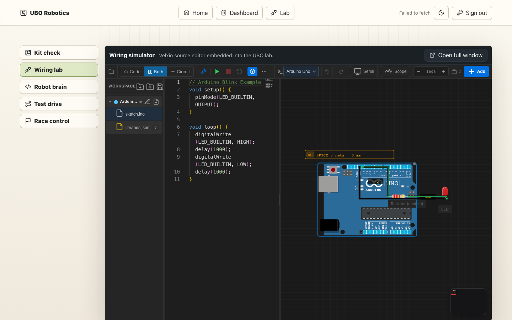
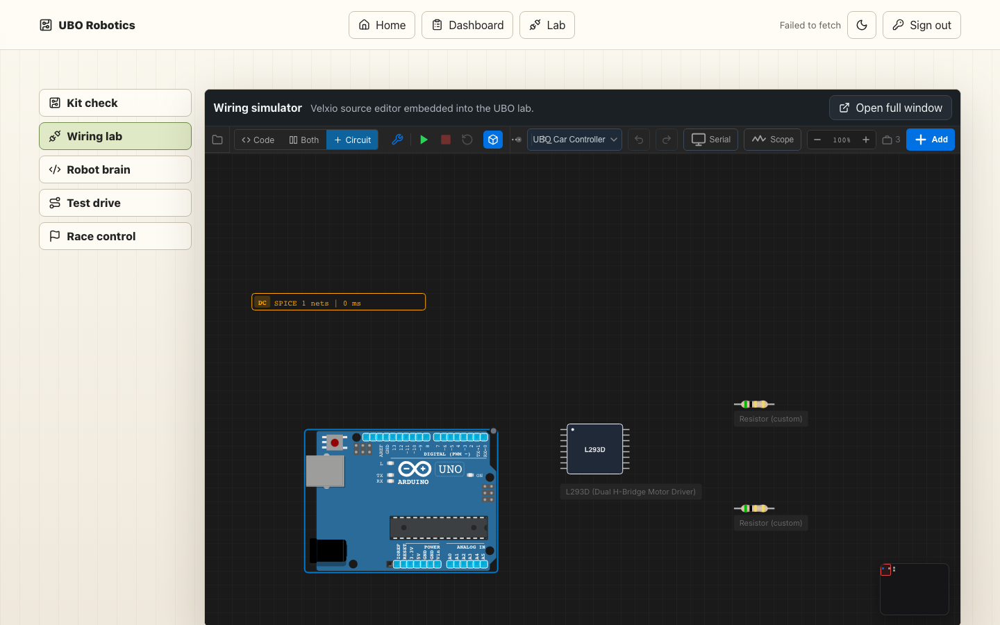
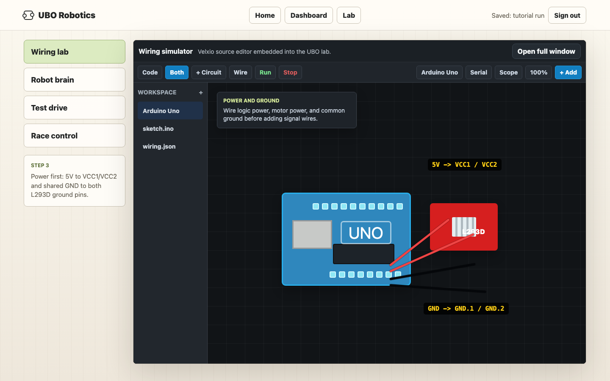
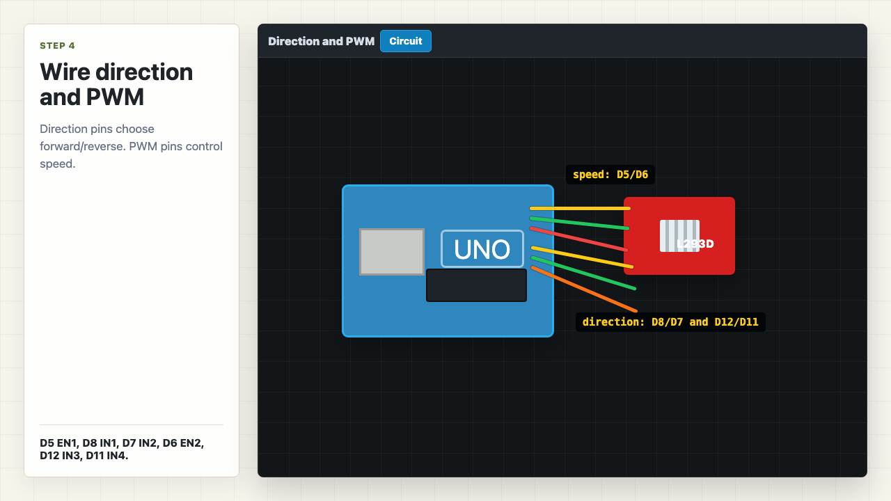
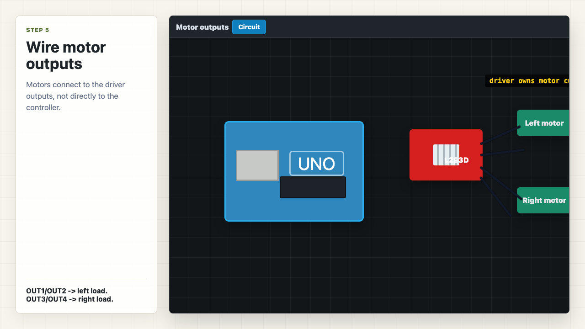
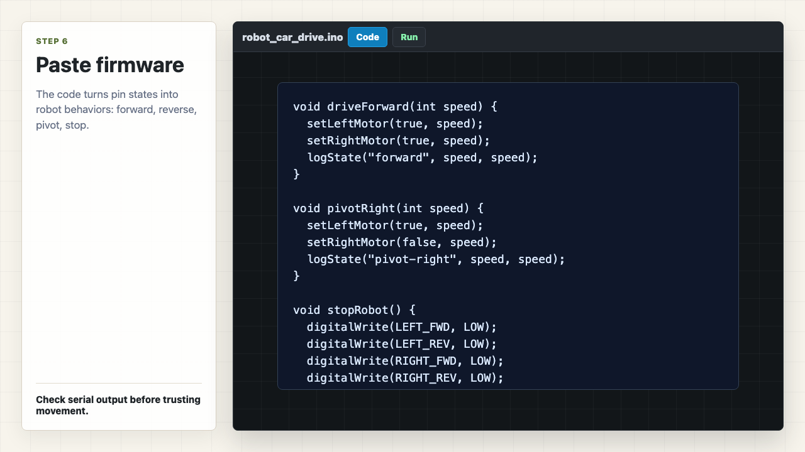
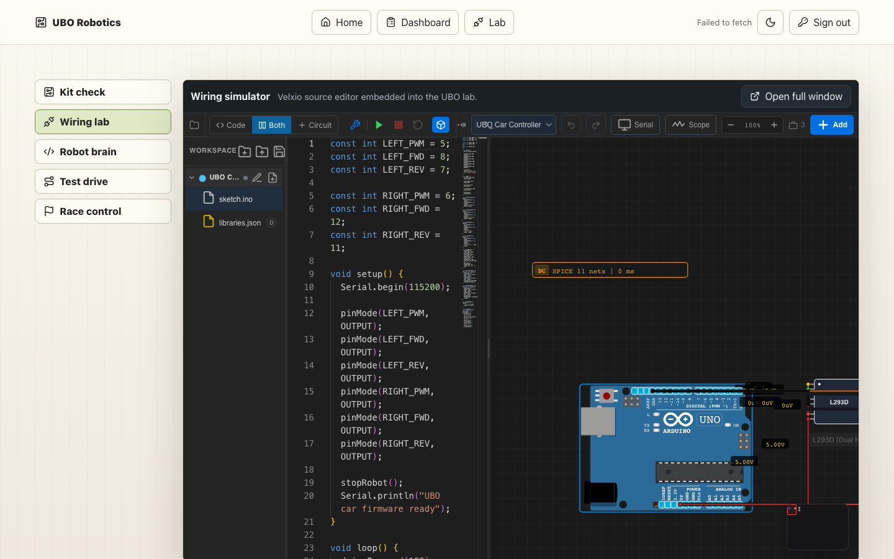
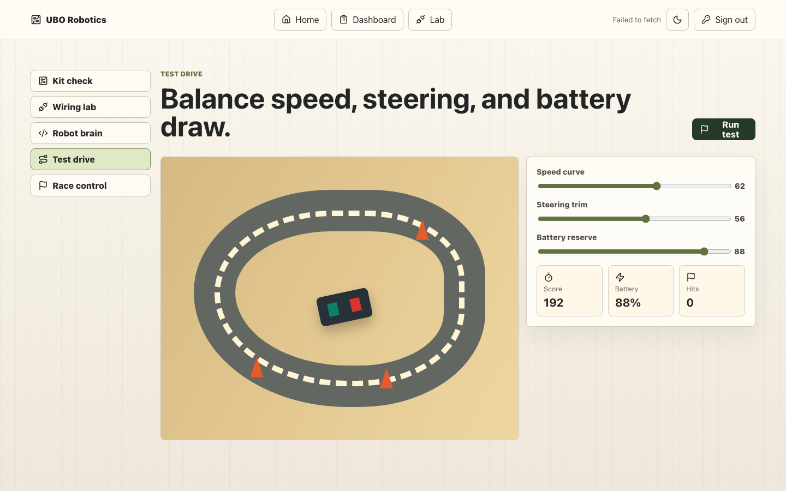

# Follow Along: Wire, Code, And Drive

Robot motion starts with small electrical decisions. A controller pin turns on or off. A motor driver reads that signal. The driver pushes current through a motor. The game reads the robot state and turns it into movement on the screen.

In this lab, you will build that chain from the beginning. You will wire a controller to a motor driver, write firmware that behaves like real robot code, run the circuit in the simulator, and connect the same behavior to the driving screen.

Move slowly. Most students try to jump straight to the game. The point of this first build is to understand why the game can move at all.

## The Goal

You are building the first complete robotics loop:

```text
wire the circuit -> write firmware -> run the simulator -> map behavior to driving controls
```

The board pins are not decorations. They are tiny output switches. When your code writes a pin `HIGH`, the pin moves toward the board's positive voltage. On an Arduino Uno, that usually means about `5V`. When your code writes a pin `LOW`, the pin moves toward ground, which is `0V`.

The motor driver reads those voltage levels and decides which way to push current through the motor load. That is how firmware becomes motion.

## 1. Start Inside The UBO Lab

Open:

```text
https://ubo.autonateai.com/
```

Start a session. If you do not need a saved student login, choose `Guest run`. From the dashboard, open `Wiring lab`.

You should see the UBO shell around the embedded Velxio editor. This matters because the lesson should happen inside the same app where your wiring, coding, driving, and reporting data gets logged.



Before moving on, confirm:

- `Wiring lab` is selected on the left.
- The embedded editor toolbar is visible.
- The canvas has the real Wokwi-style dark grid.
- You can see `Code`, `Both`, `Circuit`, and `Run` controls.

## 2. Place The Parts Like A Workbench

Now place the core parts. Keep them in a left-to-right flow:

```text
Arduino Uno -> L293D motor driver -> two motor loads
```

Use:

- `Arduino Uno`
- `L293D (Dual H-Bridge Motor Driver)`
- two `Resistor` parts set to `5 ohm`

The current editor does not expose a DC motor part yet, so the two `5 ohm` resistors are acting as motor windings for this simulation. A real motor is not just a resistor, but it does have a coil of wire inside it. Current has to pass through that coil for the motor to create force. In this beginner version, the resistor gives us a simple load so we can practice the motor-driver wiring pattern.

Think of the top resistor as the left motor load and the bottom resistor as the right motor load.



Do not wire everything yet. First, get the layout readable. A clean layout is part of debugging. If wires cross everywhere, it becomes harder to see whether a mistake is in the circuit or just in the drawing.

## 3. Wire Power And Shared Ground First

The L293D needs power before the Arduino direction pins mean anything. Wire the supply side first:

```text
Arduino 5V  -> L293D VCC1
Arduino 5V  -> L293D VCC2
Arduino GND -> L293D GND.1
Arduino GND -> L293D GND.2
```

`VCC1` is the logic power. It powers the part of the L293D that listens to Arduino control signals.

`VCC2` is the motor-output power. It powers the side of the chip that drives the motor loads. In a physical robot, `VCC2` would usually come from a battery pack because motors need more current than a controller pin can safely provide. In this first simulator pass, using `5V` keeps the circuit simple.

The most important idea is common ground. Ground is the zero-volt reference point. When the Arduino says a signal is `HIGH`, that only makes sense compared to ground. When it says a signal is `LOW`, that also means close to ground. If the Arduino and motor driver do not share ground, the driver may not understand the Arduino's signals correctly.



Before moving on, check:

- `VCC1` has power.
- `VCC2` has power.
- both L293D ground pins connect back to Arduino ground.
- the Arduino and driver share one electrical reference.

## 4. Wire Direction And PWM

Now connect the Arduino pins that control motion.

Wire the left side:

```text
D5 -> EN1
D8 -> IN1
D7 -> IN2
```

Wire the right side:

```text
D6  -> EN2
D12 -> IN3
D11 -> IN4
```

The `IN` pins are direction pins. They work in pairs. For one motor side, one input goes `HIGH` while the other goes `LOW`. That gives the driver a direction. Swap the pair, and the driver pushes current the opposite way.

For example:

```text
IN1 = HIGH, IN2 = LOW  -> left motor forward
IN1 = LOW,  IN2 = HIGH -> left motor reverse
IN1 = LOW,  IN2 = LOW  -> left motor stop/coast
```

The `EN` pins are enable pins. In this tutorial, they receive PWM for speed control. PWM means pulse-width modulation. Instead of sending a halfway voltage, the Arduino switches the pin on and off very fast. More on-time feels like more power to the motor. Less on-time feels like less power.



This is the point where firmware and wiring lock together. The pin constants in the code must match this physical wiring map. If the code thinks the left enable pin is `D5`, then the wire really needs to go from `D5` to `EN1`.

## 5. Wire The Two Motor Loads

Now connect the load side of the L293D.

Top resistor, treated as the left motor load:

```text
L293D OUT1 -> left motor load pin 1
L293D OUT2 -> left motor load pin 2
```

Bottom resistor, treated as the right motor load:

```text
L293D OUT3 -> right motor load pin 1
L293D OUT4 -> right motor load pin 2
```

This is the current path:

```text
L293D output -> motor load resistor -> L293D output
```

Do not wire these motor loads straight to Arduino ground. The whole point of the H-bridge is that the driver controls which side of the load is high and which side is low. That is how it can reverse direction.



If a motor behaves backward later, that is not a crisis. Either swap that output pair or invert that side in firmware. Real robotics work often includes this kind of correction.

## 6. Paste The Firmware

Open `sketch.ino` and paste the firmware from:

```text
firmware/robot_car_drive.ino
```

The code is organized around behavior helpers:

```text
driveForward()
driveBackward()
pivotRight()
pivotLeft()
stopRobot()
```

Each helper writes a direction pattern and a PWM speed. That means the firmware is acting like a translator between human driving language and electrical pin state.



The key constants should match your wiring:

```cpp
const int LEFT_PWM = 5;
const int LEFT_FWD = 8;
const int LEFT_REV = 7;
const int RIGHT_PWM = 6;
const int RIGHT_FWD = 12;
const int RIGHT_REV = 11;
```

When the code calls `digitalWrite(LEFT_FWD, HIGH)`, it is telling the Arduino to push that pin toward `5V`. When it calls `digitalWrite(LEFT_REV, LOW)`, it is telling the Arduino to pull that pin toward `0V`. The L293D sees that pair and drives the left load in one direction.

## 7. Run And Read The Evidence

Click `Run`.

You are not just looking for “it runs.” You are checking whether the serial story matches the circuit behavior.

Expected serial sequence:

```text
UBO car firmware ready
state=forward left=180 right=180
state=pivot-right left=165 right=165
state=pivot-left left=165 right=165
state=reverse left=150 right=150
state=stop left=0 right=0
```



Use this pass check:

- `forward`: both motor loads receive the forward direction pattern.
- `pivot-right`: left side forward, right side reverse.
- `pivot-left`: left side reverse, right side forward.
- `reverse`: both sides reverse.
- `stop`: direction pins LOW and PWM set to `0`.

If the serial output says `forward` but the wiring shows the wrong pins changing, trust the evidence. Debug the wire map before changing the code.

## 8. Connect The Circuit To Driving Controls

Now switch to `Test drive`.

This screen is where the electronics lesson becomes a game/simulation lesson. The driving controls should call the same behavior helpers that the firmware used.



Use this mapping:

```text
W     -> driveForward()
S     -> driveBackward()
A     -> pivotLeft()
D     -> pivotRight()
Space -> stopRobot()
```

The game should consume motor state like this:

```js
const robotState = {
  leftMotor: "forward",
  rightMotor: "reverse",
  leftSpeed: 165,
  rightSpeed: 165,
  action: "pivot-right"
};
```

That is the big idea: hardware-like pin states create robot state, and robot state drives the simulation. If the left motor goes forward while the right motor goes backward, the robot pivots. The game does not need magic. It needs the same state your circuit already created.

## 9. Keep One Live Editor Reference

The final screenshot is the live editor after the staged project import. Use this as a quick reference if your canvas gets messy and you want to compare the overall layout.


## Debug Order

When something looks wrong, debug in this order:

1. Confirm both L293D ground pins share Arduino ground.
2. Confirm `VCC1` and `VCC2` are powered.
3. Confirm each motor-load resistor is wired between an output pair, not to ground.
4. Confirm direction pins match the firmware constants.
5. Confirm PWM pins are on `D5` and `D6`.
6. Read serial output before changing the wiring.

## What You Learned

You did not just wire a toy circuit. You built a chain:

```text
Arduino pin state -> L293D output state -> left/right motor load behavior -> robot driving state
```

You also learned the beginner electronics ideas that make that chain work:

- `HIGH` means a pin is driven toward the board's positive voltage.
- `LOW` means a pin is driven toward ground.
- common ground gives parts the same zero-volt reference.
- PWM controls speed by switching power on and off quickly.
- a motor driver lets a small controller signal control a higher-current load.

That chain is what lets this tutorial scale. The next lessons can swap in better motor visuals, sensors, line following, obstacle avoidance, telemetry, or race strategy, but the core loop stays the same: wire it, code it, run it, compare the evidence.
